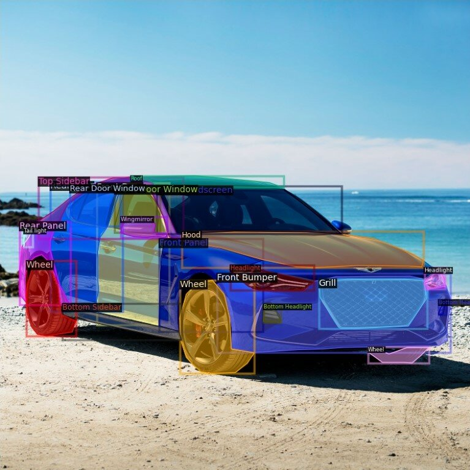

# Car Exterior components Segmentation 

## Overview
This project is an implementation of a segmentation pipeline using the UNet++ model to segment various exterior parts of cars. It is organized into modular components to handle different parts of the workflow, including data preparation, model definition, training, evaluation, and visualization of results. The segmentation focuses on segmenting up to 50 car body parts from input images.

## Project Structure
The project is organized into separate scripts to enhance modularity and maintainability. Below is the directory structure:

```
car_segmentation_pipeline/
│
├── dataset.py           # Handles data-related operations, including loading and augmentations
├── model.py             # Defines the UNet++ model architecture
├── train.py             # Trains the model and saves its weights
├── evaluate.py          # Evaluates the model's performance
├── visualize.py         # Visualizes segmentation results with respect to ground truth
├── requirements.txt     # Lists the required packages to run the project
└── README.md            # Project overview and usage instructions
```

## Requirements
To run the project, you need to have the following libraries installed:

You can install the dependencies using the following command:

```bash
pip install -r requirements.txt
```

## Dataset
The dataset should consist of images of cars and corresponding masks annotated with different parts of the vehicle. You need to organize your dataset in a specific directory structure:

```
dataset/
├── train/
│   ├── images/          # Training images
│   └── masks/           # Corresponding masks for training images
├── val/
│   ├── images/          # Validation images
│   └── masks/           # Corresponding masks for validation images
```

Ensure that each mask file corresponds to the image by having the same file name.

## Usage
### 1. Train the Model
To train the UNet++ model, use the `train.py` script. This script will load the training data, train the model, and save the model weights to the specified path.

```bash
python train.py
```

**Note:** Update the paths in `train.py` to match the location of your dataset.

### 2. Evaluate the Model
After training, you can evaluate the model's performance on the validation set using the `evaluate.py` script.

```bash
python evaluate.py
```

### 3. Visualize Results
To visualize the model's predictions compared to the ground truth, run the `visualize.py` script. This will generate plots showing the input image, ground truth mask, and the predicted mask.

```bash
python visualize.py
```

### 4. Modify Dataset or Model
- To modify the dataset loading process, you can edit the `dataset.py` script.
- To change the model architecture, you can modify `model.py`.

## Important Configuration
- **Training Parameters:** You can adjust hyperparameters such as `num_epochs`, `batch_size`, and `learning_rate` in `train.py` as per your requirements.
- **Model Paths:** Ensure that paths for saving and loading models in each script (`model_save_path` and `model_load_path`) are correct.
- **Data Transformations:** Data augmentation transformations can be updated in `train.py` and `evaluate.py` using Albumentations library.

## Project Highlights
- **Modular Code Structure:** Each major component is implemented as an independent module, making the code easier to understand, extend, and debug.
- **Comprehensive Visualization:** The `visualize.py` script helps you visualize the segmentation results, facilitating model performance assessment.
- **IoU Metric for Evaluation:** The project includes Intersection over Union (IoU) as an evaluation metric, providing a good indication of the model's performance on segmentation tasks.

## Example Segmentation Result
Below is an example of a segmented car with labeled parts:



## Future Work
- **Advanced Model Architectures:** Implement additional segmentation models such as PSPNet to compare performance.
- **Class Balancing:** Introduce methods to handle class imbalance during training, such as weighted loss functions.
- **Model Deployment:** Add a script for converting the model to a lightweight version (e.g., ONNX or TensorFlow Lite) for deployment.

## Acknowledgements
This project uses the UNet++ model for segmentation, with inspiration from various open-source implementations of segmentation models and datasets for vehicle body part segmentation.

## License
This project is licensed under the MIT License.

## Contact
If you have any questions or need further assistance, feel free to contact the project maintainer.

